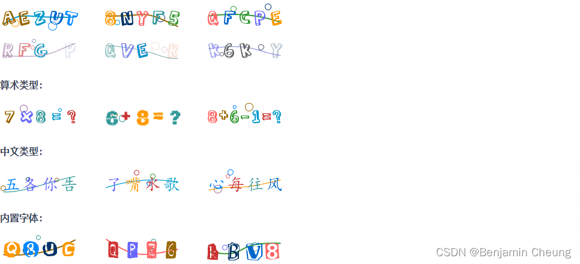

# springboot-captcha-easy

[EasyCaptcha | gitee](https://gitee.com/ele-admin/EasyCaptcha)

## 效果演示



## 引入依赖

```xml
<!-- 验证码生成插件 -->
<dependency>
    <groupId>com.github.whvcse</groupId>
    <artifactId>easy-captcha</artifactId>
    <version>1.6.2</version>
</dependency>
```

## 代码示例

> 参考：com.zja.util.CaptchaUtils.java

```java

@RestController
public class CaptchaController {

    /**
     * 获取验证码(生成验证码返回给前端)
     */
    @GetMapping("/captcha.jpg")
    public void getCaptcha(HttpServletRequest request, HttpServletResponse response) throws IOException {
        //定义图形验证码的长和宽
        CaptchaUtils.outResponse(request, response);
    }

    /**
     * 登录(校验验证码)
     *
     * @param loginUserDTO 用户信息
     */
    @PostMapping(value = "login")
    public String checkKaptcha(@RequestBody LoginUserDTO loginUserDTO, HttpServletRequest request) {
        //校验验证码
        boolean checkCode = CaptchaUtils.checkCode(request, loginUserDTO.getVerifyCode());
        if (!checkCode) {
            return "验证码错误.";
        }

        //校验用户账户和密码

        return "验证码校验成功.";
    }

}
```