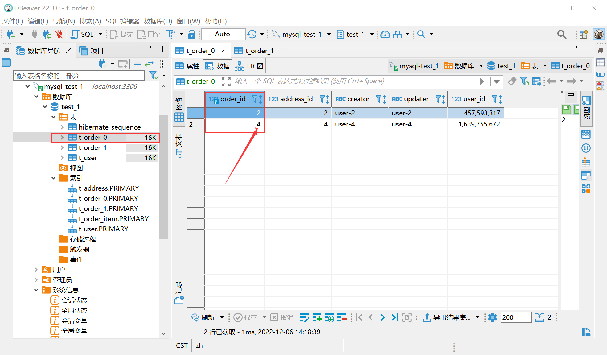
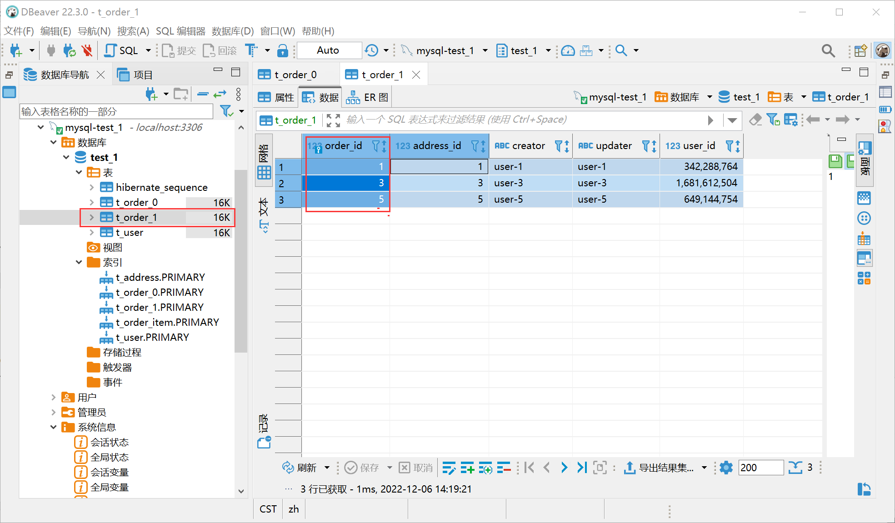
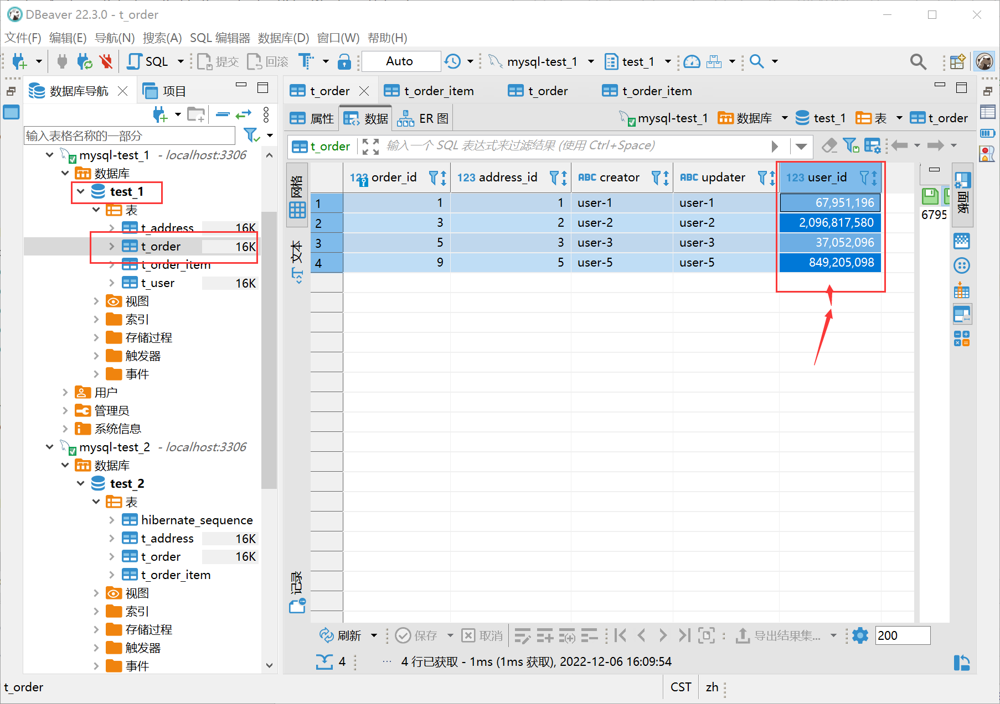
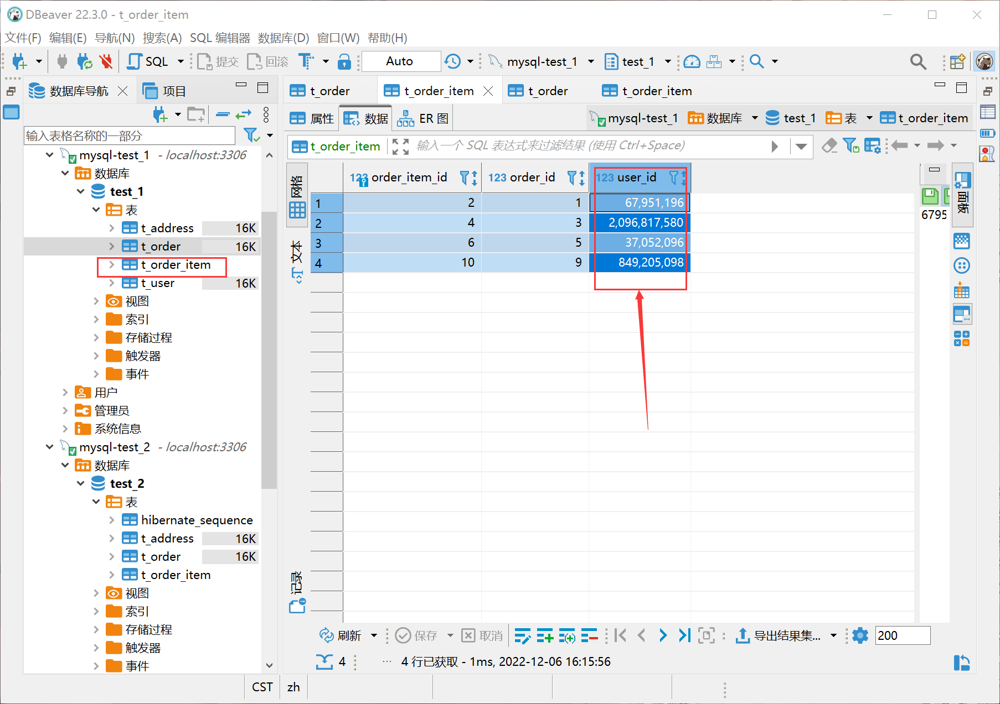
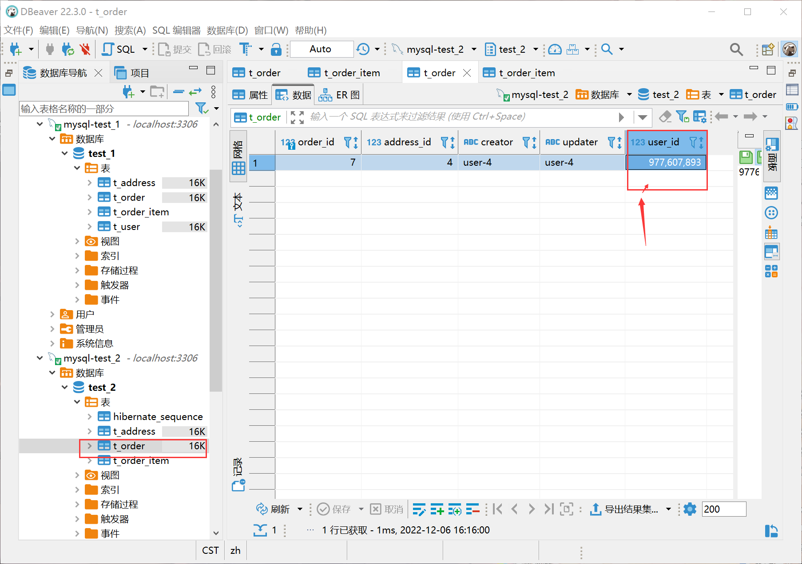
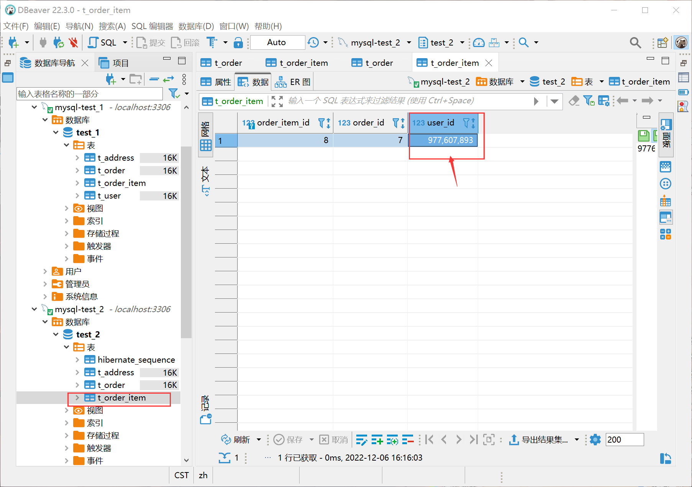
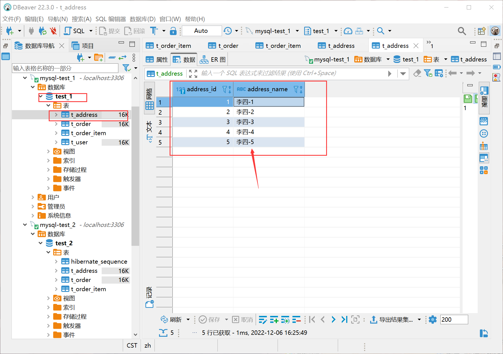
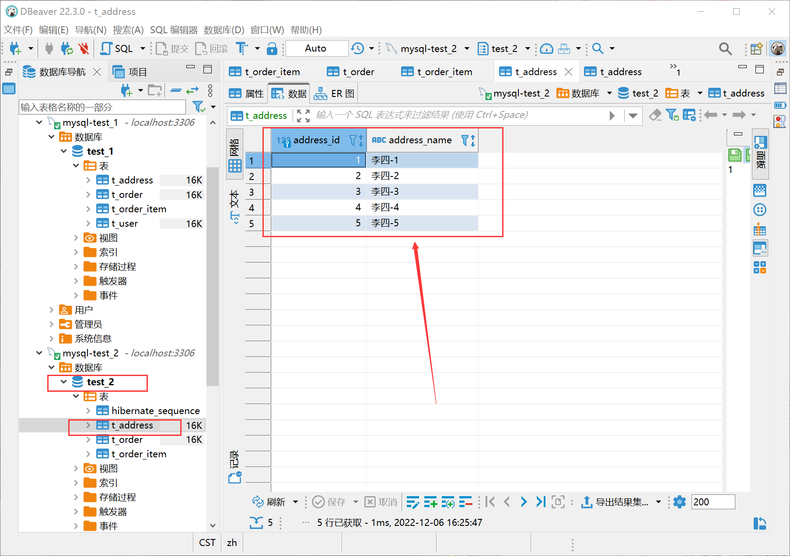

# springboot-db-shardingsphere-jpa

**shardingsphere + jpa 实现同构库(`非异构库`)分库分表、分库、分表**

- [官网](https://shardingsphere.apache.org/index_zh.html)
- [官方示例 sharding-spring-boot-jpa-example](https://github.com/apache/shardingsphere/blob/5.2.1/examples/shardingsphere-jdbc-example/single-feature-example/sharding-example/sharding-spring-boot-jpa-example)

## 引入依赖

```xml
        <dependency>
            <groupId>org.apache.shardingsphere</groupId>
            <artifactId>shardingsphere-jdbc-core-spring-boot-starter</artifactId>
            <version>5.2.1</version>
        </dependency>
        <dependency>
            <groupId>org.yaml</groupId>
            <artifactId>snakeyaml</artifactId>
            <version>1.33</version>
        </dependency>
        <dependency>
            <groupId>org.springframework.boot</groupId>
            <artifactId>spring-boot-starter-data-jpa</artifactId>
        </dependency>
```

## 分表

> 分表: 在库中把一张表拆分为多张表, 例 t_order表拆分为t_order_0、t_order_1两张表，可以根据分表策略把数据存储到拆分的表

- [官方配置 application-sharding-tables.properties](https://github.com/apache/shardingsphere/blob/5.2.1/examples/shardingsphere-jdbc-example/single-feature-example/sharding-example/sharding-spring-boot-jpa-example/src/main/resources/application-sharding-tables.properties)

### 实体类

> 主键策略：使用了jpa id主键策略 `@GeneratedValue AUTO` 自动生成id值，此处没有使用shardingsphere `key-generate-strategy`主键策略

```java
@Data
@Entity
@Table(name = "t_order")
public class OrderEntity {
    @Id
    @GeneratedValue//(strategy = GenerationType.IDENTITY)
    private Long orderId;
    private int userId;
    private long addressId;
    private String creator;
    private String updater;
}

@Data
@Entity
@Table(name = "t_order_item")
public class OrderItemEntity {
    @Id
    @GeneratedValue//(strategy = GenerationType.IDENTITY)
    private Long orderItemId;
    private Long orderId;
    private int userId;
}

@Data
@Entity
@Table(name = "t_address")
public class AddressEntity {
    @Id
    @GeneratedValue//(strategy = GenerationType.IDENTITY)
    private Long addressId;
    private String addressName;
}

@Data
@Entity
@Table(name = "t_user")
public class UserEntity {
    @Id
    @GeneratedValue//(strategy = GenerationType.IDENTITY)
    private Long userId;
    private String username;
    private String pwd;
}
```

### 基本配置

```yaml
spring:
  jpa:
    show-sql: true
    hibernate:
      ddl-auto: update
  #同库分表
  shardingsphere:
    datasource:
      names: ds
      ds:
        type: com.zaxxer.hikari.HikariDataSource
        driver-class-name: com.mysql.cj.jdbc.Driver
        jdbc-url: jdbc:mysql://localhost:3306/test_1?serverTimezone=UTC&useSSL=false&allowPublicKeyRetrieval=true&useUnicode=true&characterEncoding=UTF-8
        username: test_1
        password: pass
    rules:
      sharding:
        #配置表的规则
        tables:
          #配置某张表的分库分表规则
          t_order:
            #配置 t_order 表规则
            actual-data-nodes: ds.t_order_$->{0..1}   # 可能有2个表[0,1],不然会导致表丢失识别不到
            #分表策略
            table-strategy:
              #标准策略
              standard:
                sharding-column: order_id             # 按指定字段进行分表存储、查询等操作
                sharding-algorithm-name: table-inline # 选择分片算法
        #定义分片算法
        sharding-algorithms:
          table-inline:
            type: INLINE  # 标准分片算法 行表达式分片算法
            props:
              algorithm-expression: t_order_$->{order_id % 2}
              allow-range-query-with-inline-sharding: true  #允许范围查询，走全表扫描的范围查询,INLINE默false
    props:
      sql-show: true
```

### 单元测试

```java
@Slf4j
@SpringBootTest
public class OrderRepositoryTests {
    @Autowired 
    private OrderRepository orderRepository;

    @Test
    public void save() {
        ThreadLocalRandom random = ThreadLocalRandom.current();

        IntStream.rangeClosed(1, 5).forEach(i -> {
            OrderEntity order = new OrderEntity();
            order.setAddressId(i);
            order.setUserId(Math.abs(random.nextInt()));
            order.setCreator("user-" + i);
            order.setUpdater(order.getCreator());
            System.out.println(order);
            orderRepository.save(order);
        });

        List<OrderEntity> entityList = orderRepository.findAll();
        entityList.forEach(s -> System.out.println(s));
    }
}
```

数据库分表效果图：




## 分库

- [官方配置 application-sharding-databases.properties](https://github.com/apache/shardingsphere/blob/5.2.1/examples/shardingsphere-jdbc-example/single-feature-example/sharding-example/sharding-spring-boot-jpa-example/src/main/resources/application-sharding-databases.properties)

### yaml配置

```yaml
#分库

spring:
  jpa:
    show-sql: true
    hibernate:
      ddl-auto: create
  shardingsphere:
    datasource:
      names: ds-0,ds-1
      ds-0:
        type: com.zaxxer.hikari.HikariDataSource
        driver-class-name: com.mysql.cj.jdbc.Driver
        jdbc-url: jdbc:mysql://localhost:3306/test_1?serverTimezone=UTC&useSSL=false&allowPublicKeyRetrieval=true&useUnicode=true&characterEncoding=UTF-8
        username: test_1
        password: pass
      ds-1:
        type: com.zaxxer.hikari.HikariDataSource
        driver-class-name: com.mysql.cj.jdbc.Driver
        jdbc-url: jdbc:mysql://localhost:3306/test_2?serverTimezone=UTC&useSSL=false&allowPublicKeyRetrieval=true&useUnicode=true&characterEncoding=UTF-8
        username: test_2
        password: pass
    rules:
      sharding:
        #绑定表规则列表，指分片规则一致的主表和子表
        binding-tables:
          - t_order,t_order_item
        #广播表规则列表，表结构和表中的数据在每个数据库中均完全⼀致
        broadcast-tables: t_address
        #默认数据库分片策略，同分库策略
        default-database-strategy:
          standard:
            sharding-column: user_id  #指定根据哪个字段进行分片
            sharding-algorithm-name: database-inline  # 选择分片算法
        #定义分片算法
        sharding-algorithms:
          database-inline:
            type: INLINE
            props:
              algorithm-expression: ds-$->{user_id % 2}   #配置分片规则
        #配置某张表的分库分表规则
        tables:
          t_order:
            #配置 t_order 表规则
            actual-data-nodes: ds-$->{0..1}.t_order
          #配置 t_order_item 表规则
          t_order_item:
            actual-data-nodes: ds-$->{0..1}.t_order_item
    props:
      sql-show: tru
```

### 单元测试

分库代码示例

```java
@SpringBootTest
public class OrderItemRepositoryTests {

    @Autowired
    private OrderRepository orderRepository;
    @Autowired
    private OrderItemRepository orderItemRepository;


    @Test
    public void save() {
        ThreadLocalRandom random = ThreadLocalRandom.current();

        IntStream.rangeClosed(1, 5).forEach(i -> {
            int userId = Math.abs(random.nextInt());

            OrderEntity order = new OrderEntity();
            order.setAddressId(i);
            order.setUserId(userId);
            order.setCreator("user-" + i);
            order.setUpdater(order.getCreator());
            System.out.println(order);
            orderRepository.save(order);

            OrderItemEntity orderItem = new OrderItemEntity();
            orderItem.setOrderId(order.getOrderId());
            orderItem.setUserId(userId);
            System.out.println(orderItem);
            orderItemRepository.save(orderItem);
        });

        List<OrderItemEntity> entityList = orderItemRepository.findAll();
        entityList.forEach(s -> System.out.println(s));
    }
}
```

数据库分库效果图：





顺便测试下分库中广播表示例：

```java
@SpringBootTest
public class AddressRepositoryTests {

    @Autowired
    AddressRepository addressRepository;

    //广播表规则列表，表结构和表中的数据在每个数据库中均完全⼀致
    @Test
    public void test() {
        IntStream.rangeClosed(1, 5).forEach(i -> {
            AddressEntity entity = new AddressEntity();
            entity.setAddressName("李四-" + i);
            System.out.println(entity);
            addressRepository.save(entity);
        });

        List<AddressEntity> entityList = addressRepository.findAll();
        entityList.forEach(s -> System.out.println(s));
    }
}
```

数据库分库广播表效果图：


可以看出，广播表在两个库中表结构和数据存储完全一致。

记一个问题，后面会解决：
其实，还有一张 t_user 表，并未绑定规则，有个现象是在每次启动项目jpa create创建库中表结构时t_user表会在ds-0,ds-1两个库之间来回跳跃创建，这是因为不需要分开库分表的表没有设置默认数据库。

## 分库分表

```yaml
#分库分表

spring:
  jpa:
    show-sql: true
    hibernate:
      ddl-auto: create
  shardingsphere:
    datasource:
      names: ds-0,ds-1
      ds-0:
        type: com.zaxxer.hikari.HikariDataSource
        driver-class-name: com.mysql.cj.jdbc.Driver
        jdbc-url: jdbc:mysql://localhost:3306/test_1?serverTimezone=UTC&useSSL=false&allowPublicKeyRetrieval=true&useUnicode=true&characterEncoding=UTF-8
        username: test_1
        password: pass
        max-active: 16
      ds-1:
        type: com.zaxxer.hikari.HikariDataSource
        driver-class-name: com.mysql.cj.jdbc.Driver
        jdbc-url: jdbc:mysql://localhost:3306/test_2?serverTimezone=UTC&useSSL=false&allowPublicKeyRetrieval=true&useUnicode=true&characterEncoding=UTF-8
        username: test_2
        password: pass
        max-active: 16
    rules:
      sharding:
        #绑定表规则列表，指分片规则一致的主表和子表
        binding-tables:
          - t_order,t_order_item
        #广播表规则列表，表结构和表中的数据在每个数据库中均完全⼀致
        broadcast-tables: t_address
        #默认数据库分片策略，同分库策略
        default-database-strategy:
          standard:
            sharding-column: user_id  #指定根据哪个字段进行分片
            sharding-algorithm-name: database-inline  # 选择分片算法
        #定义分片算法
        sharding-algorithms:
          database-inline:
            type: INLINE
            props:
              algorithm-expression: ds-$->{user_id % 2}   #配置分片规则
          table-inline-order:
            type: INLINE
            props:
              algorithm-expression: t_order_$->{order_id % 2}   #配置分片规则
          table-inline-order-item:
            type: INLINE
            props:
              algorithm-expression: t_order_item_$->{order_id % 2}   #配置分片规则
        #配置某张表的分库分表规则
        tables:
          t_order:
            #配置 t_order 表规则
            actual-data-nodes: ds-$->{0..1}.t_order_$->{0..1}
            table-strategy:
              standard:
                sharding-column: order_id  #指定根据哪个字段进行分片
                sharding-algorithm-name: table-inline-order  # 选择分片算法
          #配置 t_order_item 表规则
          t_order_item:
            actual-data-nodes: ds-$->{0..1}.t_order_item_$->{0..1}
            table-strategy:
              standard:
                sharding-column: order_id  #指定根据哪个字段进行分片
                sharding-algorithm-name: table-inline-order-item  # 选择分片算法
    props:
      sql-show: true

```

### 单元测试

```java
@SpringBootTest
public class OrderItemRepositoryTests {

    @Autowired
    private OrderRepository orderRepository;
    @Autowired
    private OrderItemRepository orderItemRepository;


    @Test
    public void save() {
        ThreadLocalRandom random = ThreadLocalRandom.current();

        IntStream.rangeClosed(1, 5).forEach(i -> {
            int userId = Math.abs(random.nextInt());

            OrderEntity order = new OrderEntity();
            order.setAddressId(i);
            order.setUserId(userId);
            order.setCreator("user-" + i);
            order.setUpdater(order.getCreator());
            System.out.println(order);
            orderRepository.save(order);

            OrderItemEntity orderItem = new OrderItemEntity();
            orderItem.setOrderId(order.getOrderId());
            orderItem.setUserId(userId);
            System.out.println(orderItem);
            orderItemRepository.save(orderItem);
        });

        List<OrderItemEntity> entityList = orderItemRepository.findAll();
        entityList.forEach(s -> System.out.println(s));
    }
}
```

## 自动分库分表

### yaml配置

```yaml
#自动分库分表

spring:
  jpa:
    show-sql: true
    hibernate:
      ddl-auto: create
  shardingsphere:
    datasource:
      names: ds-0,ds-1
      ds-0:
        type: com.zaxxer.hikari.HikariDataSource
        driver-class-name: com.mysql.cj.jdbc.Driver
        jdbc-url: jdbc:mysql://localhost:3306/test_1?serverTimezone=UTC&useSSL=false&allowPublicKeyRetrieval=true&useUnicode=true&characterEncoding=UTF-8
        username: test_1
        password: pass
      ds-1:
        type: com.zaxxer.hikari.HikariDataSource
        driver-class-name: com.mysql.cj.jdbc.Driver
        jdbc-url: jdbc:mysql://localhost:3306/test_2?serverTimezone=UTC&useSSL=false&allowPublicKeyRetrieval=true&useUnicode=true&characterEncoding=UTF-8
        username: test_2
        password: pass
    rules:
      sharding:
        #绑定表规则列表，指分片规则一致的主表和子表
        binding-tables:
          - t_order,t_order_item
        #广播表规则列表，表结构和表中的数据在每个数据库中均完全⼀致
        broadcast-tables: t_address
        #默认数据库分片策略，同分库策略
        default-database-strategy:
          standard:
            sharding-column: user_id  #指定根据哪个字段进行分片
            sharding-algorithm-name: database-inline  # 选择分片算法
        #定义分片算法
        sharding-algorithms:
          database-inline:
            type: INLINE
            props:
              algorithm-expression: ds-$->{user_id % 2}   #配置分片规则
          auto-mod:
            type: mod
            props:
              sharding-count: 4
        auto-tables:
          t_order:
            actual-datasources: ds-${0..1}
            sharding-strategy:
              standard:
                sharding-column: order_id           #指定根据哪个字段进行分片
                sharding-algorithm-name: auto-mod   # 选择分片算法
          t_order_item:
            actual-datasources: ds-${0..1}
            sharding-strategy:
              standard:
                sharding-column: order_item_id      #指定根据哪个字段进行分片
                sharding-algorithm-name: auto-mod   # 选择分片算法
    props:
      sql-show: true

```

### 单元测试

```java
@SpringBootTest
public class OrderItemRepositoryTests {

    @Autowired
    private OrderRepository orderRepository;
    @Autowired
    private OrderItemRepository orderItemRepository;


    @Test
    public void save() {
        ThreadLocalRandom random = ThreadLocalRandom.current();

        IntStream.rangeClosed(1, 5).forEach(i -> {
            int userId = Math.abs(random.nextInt());

            OrderEntity order = new OrderEntity();
            order.setAddressId(i);
            order.setUserId(userId);
            order.setCreator("user-" + i);
            order.setUpdater(order.getCreator());
            System.out.println(order);
            orderRepository.save(order);

            OrderItemEntity orderItem = new OrderItemEntity();
            orderItem.setOrderId(order.getOrderId());
            orderItem.setUserId(userId);
            System.out.println(orderItem);
            orderItemRepository.save(orderItem);
        });

        List<OrderItemEntity> entityList = orderItemRepository.findAll();
        entityList.forEach(s -> System.out.println(s));
    }
}
```

## Sharding-JDBC中的分片策略

- [示例参考](https://blog.csdn.net/qq_34279995/article/details/122421989)

### 自动分片算法

- 取模分片算法
- 哈希取模分片算法
- 基于分片容量的范围分片算法
- 基于分片边界的范围分片算法
- 自动时间段分片算法

#### 取模分片算法

#### 哈希取模分片算法

#### 基于分片容量的范围分片算法

#### 基于分片边界的范围分片算法

#### 自动时间段分片算法


### 标准分片算法

- 行表达式分片算法
- 时间范围分片算法

#### 行表达式分片算法

#### 时间范围分片算法


### 复合分片算法

- 复合行表达式分片算法

#### 复合行表达式分片算法

### Hint分片算法

- Hint行表达式分片算法

#### Hint行表达式分片算法

### 自定义类分片算法

- 自定义类分片算法1
- 自定义类分片算法2

### 分片算法原理

- ClassBasedShardingAlgorithm 详解


## 其它应用配置

### 读写分离配置

## 问题汇总记录

**1、解决主键配置不生效**

配置 keyGenerator 主键生成策略节点不起作用，用 JPA 在写入数据时报错 “ids for this class must be manually assigned before calling save()” 就是说在调用save（）之前，必须手动分配此类的ID。
出现这个问题就是  keyGenerator 配置没起作用，在调用 save() 时没有生成主键 ID。

方案一：手动配置主键 ID
```java
    @Id
    @GeneratedValue(generator = "entityIdGenerator")
    @GenericGenerator(name = "entityIdGenerator", strategy = "com.zja.util.SnowflakeIdUtil")
    private Long id;
    
    //@Id
    //private Long id = SnowflakeIdUtil.generatorId;
```

注意：jpa 主键配置@GeneratedValue默认为AUTO时，shardingsphere配置的key-generate-strategy不会生效。

方案二：自定义一个主键生成策略
```java
    @Id
    @GeneratedValue(strategy = GenerationType.IDENTITY)
    private Long id;
```
同时在*.yml 配置文件正确配置 keyGenerator，然后在主键添加相关注解
```yaml
spring:
  #同库分表
  shardingsphere:
    rules:
      sharding:
        #配置表的规则
        tables:
          #配置某张表的分库分表规则
          t_order:
            #主键生成策略
            key-generate-strategy:
              column: order_id  # 主键列
              key-generator-name: snowflake  # 策略算法名称(推荐使用雪花算法)
        #定义主键生成算法
        key-generators:
          snowflake:
            type: SNOWFLAKE # 雪花算法，也支持 UUID
```
