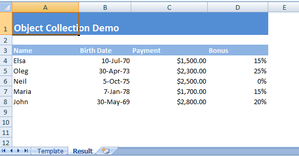

# springboot-file-jxls

**Jxls Excel 操作**


## 引入依赖

```xml
        <!--jxls 操作 Excel和 csv -->
        <dependency>
            <groupId>org.jxls</groupId>
            <artifactId>jxls</artifactId>
            <version>2.12.0</version>
        </dependency>

        <!--转换器实现：jxls-poi-->
        <dependency>
            <groupId>org.jxls</groupId>
            <artifactId>jxls-poi</artifactId>
            <!--包含 poi 4.1.2-->
            <version>2.12.0</version>
        </dependency>
```

## 简单示例

模版示例，[下载模板](https://jxls.sourceforge.net/xls/object_collection_template.xls)

> 说明：在 Excel 单元格批注中定义 Jxls 命令   
> 模版讲解：  
> 1、设置设置模板的区域，批注jx:area(lastCell=“D4”)表示模板的区域由A1(加批注的单元格)到D4   
> 2、定义Jxls Each循环命令，Each命令遍历Jxls Context中“data”对应的列表,并将列表中的每个值以“d”的键存入Context中（通过var定义）。Each命令的内容区域是A4:D4（通过lastCell定义），每一个context的d对象都会复制该区域并处理内容      
> 3、在模板 区域A1:D4中，找到与之对应的key赋值   


代码示例

```java
public class Employee {
    private String name;
    private Date birthDate;
    private BigDecimal payment;
    private BigDecimal bonus;
    // ... constructors
    // ... getters/setters
}
```

```java
    logger.info("Running Object Collection demo");
    List<Employee> employees = generateSampleEmployeeData();
    try(InputStream is = ObjectCollectionDemo.class.getResourceAsStream("object_collection_template.xls")) {
        try (OutputStream os = new FileOutputStream("target/object_collection_output.xls")) {
            Context context = new Context();
            context.putVar("employees", employees);
            JxlsHelper.getInstance().processTemplate(is, os, context);
        }
    }
```

生成效果




## 常见问题

**Q：jxls2.x 如何给单元格添加索引号？**  

A：jxls2.7.0 新增单元格添加索引号, 给单元格添加批注 `varIndex="index"` , 使用方式 ${index+1}

```text
jx:each(items="performList" var="pp" varIndex="index" lastCell="S4")
```

**Q:如何处理时间戳太长不显示问题，单元格值变为`####`无法显示短日期情况.**

A:在jxls1.x不存在这个问题，在jxls2.x存在时间戳不能显示未短日期，需要自己特殊处理，通过自定义函数实现

```java
        try (InputStream is = getClass().getClassLoader().getResourceAsStream("map_template.xlsx")) {
            try (OutputStream os = new FileOutputStream("map_output.xlsx")) {
                Context context = new Context(map);
                //context.putVar("data", map); //data.performList

                //测试工具类处理时间
                context.putVar("newDate", new Date());
                context.putVar("newLocalDate", LocalDateTime.now());
                context.putVar("stringDate", "2023-01-05");
                context.putVar("timeStamp", 1672800485279L);
                context.putVar("dateFormatter", "yyyy-MM-dd");
                context.putVar("dateTimeFormatter", "yyyy-MM-dd HH:mm:ss");


                JxlsHelper jxlsHelper = JxlsHelper.getInstance();
                Transformer transformer = jxlsHelper.createTransformer(is, os);
                //获得配置
                JexlExpressionEvaluator evaluator = (JexlExpressionEvaluator) transformer.getTransformationConfig()
                        .getExpressionEvaluator();
                //函数强制，自定义功能
                Map<String, Object> funcs = new HashMap<String, Object>();
                funcs.put("utils", new JxlsUtils()); //添加自定义功能
                JexlBuilder jb = new JexlBuilder();
                jb.namespaces(funcs);
//                jb.silent(true); //设置静默模式，不报警告
                JexlEngine je = jb.create();
                evaluator.setJexlEngine(je);

                //解决时间戳过长无法显示 “#####” (设置时间格式也不能用)
                JxlsHelper.getInstance().processTemplate(context, transformer);
            }
        }
```

工具类

```java
public class JxlsUtils {
    /**
     * 日期转换
     * ${utils:dateConvert(dateTime, dateTimeFormatter)} 单元格内
     * utils:dateConvert(dateTime, dateTimeFormatter) 批注内
     *
     * @param dateTime          日期时间，示例 {@link Date} or {@link LocalDateTime}
     * @param dateTimeFormatter 时间格式，示例 yyyy-MM-dd or yyyy-MM-dd HH:mm:ss
     * @return
     */
    public String dateConvert(Object dateTime, Object dateTimeFormatter) {
        if (ObjectUtils.isEmpty(dateTime)) {
            return null;
        }

        if (ObjectUtils.isEmpty(dateTimeFormatter)) {
            throw new RuntimeException("转换日期失败: dateTime=" + dateTime + " ,dateTimeFormatter is not is null." + dateTimeFormatter);
        }

        String pattern = (String) dateTimeFormatter;

        if (dateTime instanceof Date) {
            //Date 时间
            Date date = (Date) dateTime;
            SimpleDateFormat sdf = new SimpleDateFormat(pattern);
            return sdf.format(date);
        }

        if (dateTime instanceof LocalDateTime) {
            //java8 时间格式
            LocalDateTime localDate = (LocalDateTime) dateTime;
            return localDate.format(DateTimeFormatter.ofPattern(pattern));
        }

        if (dateTime instanceof Long) {
            //时间戳
            Long timeStamp = (Long) dateTime;
            Instant instant = Instant.ofEpochMilli(timeStamp);
            Date date = Date.from(instant);
            SimpleDateFormat sdf = new SimpleDateFormat(pattern);
            return sdf.format(date);
        }

        if (dateTime instanceof String) {
            //字符串时间,使用java8 时间格式
            String dateStr = (String) dateTime;
            Date date = DateUtil.parse(dateStr);
            return DateUtil.format(date, pattern);
        }

        throw new RuntimeException("转换日期失败: dateTime=" + dateTime + " ,dateTimeFormatter=" + dateTimeFormatter);
    }

}
```