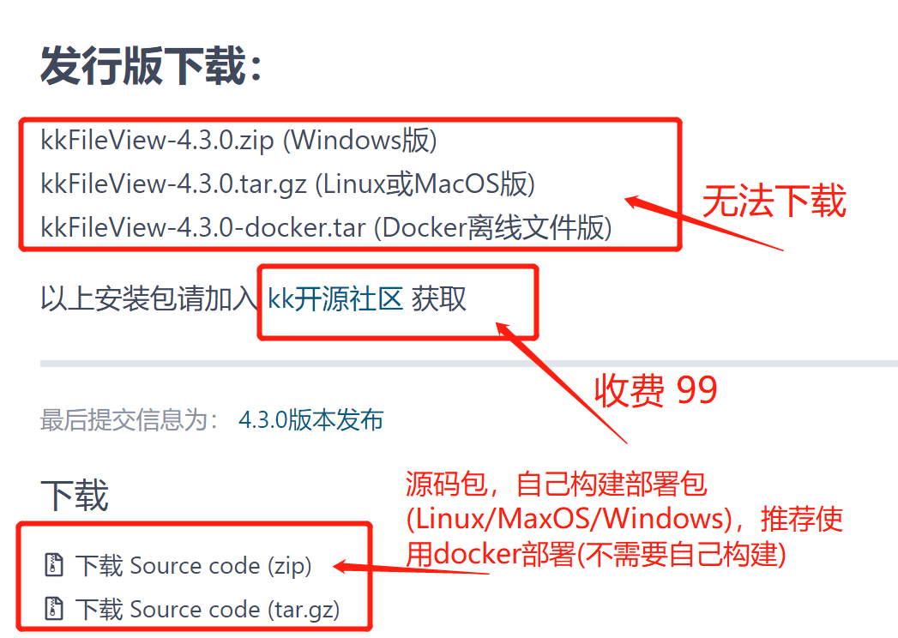

# springboot-file-preview-kkview

- [kkview.cn 官网](https://kkview.cn/zh-cn/index.html)
- [kkview.cn 在线演示](https://file.kkview.cn/)
- [kkview.cn 部署指南](https://kkview.cn/zh-cn/docs/production.html)
- [kkview.cn 使用指南](https://kkview.cn/zh-cn/docs/usage.html)

## kkview 安装

> 由于kkview搞了一个《[KK开源社区](https://public.zsxq.com/groups/48844125114258.html)》 收费的
> 不直接提供安装包(Linux/Windows)了，也就是不能直接通过github直接下载安装包部署了，但docker镜像不影响安装部署。
> 因此，需要自己手动下载源码镜像构建安装包(Linux/Windows)



### 构建 Windows 安装包

拉取代码

```shell
git clone https://gitee.com/kekingcn/file-online-preview.git

#切换至版本标签：v4.3.0
git checkout v4.3.0
```

编译

```shell
mvn clean package -Dmaven.test.skip=true
```

解压target目录下二进制文件

```shell
# 手动解压
kkFileView-4.3.0.zip
```

启动

```shell
cd kkFileView-4.3.0/bin
#双击启动，会遇到关闭后，无法再启起来问题
startup.bat
```

### 构建 Linux 安装包

拉取代码

```shell
git clone https://gitee.com/kekingcn/file-online-preview.git

#切换至版本标签：v4.3.0
git checkout v4.3.0
```

编译

```shell
mvn clean package -Dmaven.test.skip=true
```

解压target目录下二进制文件

```shell
tar -zxvf kkFileView-4.3.0.tar.gz
```

安装

```shell
cd kkFileView-4.3.0/bin
#安装环境
./install.sh
```

启动

```shell
./startup.sh
```

关闭

```shell
shutdown.sh
```

重启

```shell
sh shutdown.sh
sh startup.sh
sh showlog.sh
```

### 构建 Docker 安装包

> 说明下，docker安装包官方已经提供:    
> 1、安装命令：`docker pull keking/kkfileview:4.3.0`   
> 2、运行命令：`docker run -it -p 8012:8012 keking/kkfileview:4.3.0`

拉取镜像

```shell
# 网络环境方便访问docker中央仓库
docker pull keking/kkfileview:4.3.0

# 网络环境不方便访问docker中央仓库
wget https://kkview.cn/resource/kkFileView-4.3.0-docker.tar
docker load -i kkFileView-4.3.0-docker.tar
```

运行启动

```shell
docker run -it -p 8012:8012 keking/kkfileview:4.3.0
```

浏览器访问容器8012端口 http://127.0.0.1:8012 即可看到项目演示用首页

## 前端使用示例

【http/https 资源文件预览】，达到对docx、excel、ppt、jpg等文件的预览效果,通过在你的项目中加入下面的代码就可以成功实现：

```javascript
<script type="text/javascript" src="https://cdn.jsdelivr.net/npm/js-base64@3.6.0/base64.min.js"></script>

var url = 'http://127.0.0.1:8080/file/test.txt'; //要预览文件的访问地址
window.open('http://127.0.0.1:8012/onlinePreview?url=' + encodeURIComponent(Base64.encode(previewUrl)));
```

【http/https 流资源文件预览】很多系统内不是直接暴露文件下载地址，而是请求通过id、code等参数到通过统一的接口，后端通过id或code等参数定位文件，再通过OutputStream输出下载，
此时下载url是不带文件后缀名的，预览时需要拿到文件名，传一个参数fullfilename=xxx.xxx来指定文件名，示例如下:

```javascript
<script type="text/javascript" src="https://cdn.jsdelivr.net/npm/js-base64@3.6.0/base64.min.js"></script>

var url = 'http://127.0.0.1:8080/filedownload?fileId=1'; //要预览文件的访问地址
window.open('http://127.0.0.1:8012/onlinePreview?fullfilename=test.txt&url=' + encodeURIComponent(Base64.encode(previewUrl)));
```

## 后台使用示例

[KkviewController.java](./src/main/java/com/zja/controller/KkviewController.java)

## 思考 & 改进意见

部署

* kkfileview 新版没法从官网直接下载windows、linux、mac等所需的安装包，需要自己手动通过源码打包，部署时可能会遇到一些问题
* kkfileview docker部署不需要自己构建，比较推荐

预览方式扩展

* 后续希望提供数据源预览方案，比如：mongodb、minio、url等数据源，提供更高效和安全的预览方案。

## 适配的中间件版本

> 以下是你可能会用到的中间件

|            | 官网文档                                               | github                                                        | 使用版本下载                                                    | 详细 | 推荐 |
|------------|----------------------------------------------------|---------------------------------------------------------------|-----------------------------------------------------------|----|----| 
| kkfileview | [kkview.cn 官网](https://kkview.cn/zh-cn/index.html) | [kekingcn/kkFileView](https://github.com/kekingcn/kkFileView) | [v4.3.0](https://github.com/kekingcn/kkFileView/releases) |    |    |