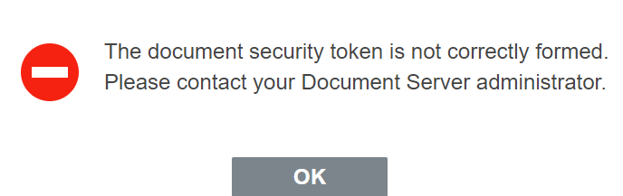

# springboot-file-preview-onlyoffice

- [onlyoffice.com 官网](https://helpcenter.onlyoffice.com/)
- [onlyoffice.org.cn 中文官网-推荐](https://www.onlyoffice.org.cn/)

## 安装部署

> 为了方便演示，这里使用docker方式

拉取镜像

```shell
docker pull onlyoffice/documentserver
```

快速创建并启动

```shell
docker run -i -t -d -p 80:80 --restart=always onlyoffice/documentserver
```

* -p 80:80 表示端口映射，前者是宿主机端口，后者是容器内的映射端口。
* --restart=always 容器自动重启
* onlyoffice/documentserver 镜像名称

检查安装是否成功

```shell
# 浏览器中, 访问地址
IP:PORTS/welcome
```

集成地址

```javascript
<!-- documentserver替换为部署环境的[IP:PORTS]或者[代理域名地址]-->
<script type="text/javascript" src="https://documentserver/web-apps/apps/api/documents/api.js"></script>
```

## 使用HTML集成ONLYOFFICE

确保相应的js文件可以被正常访问

```javascript
<!-- documentserver替换为部署环境的[IP:PORTS]或者[代理域名地址]-->
<script type="text/javascript" src="https://documentserver/web-apps/apps/api/documents/api.js"></script>
```

添加div元素

```html

<div id="placeholder"></div>
```

可变参数的传递

```javascript
var docEditor = new DocsAPI.DocEditor("placeholder", config);
```

```javascript
config = {
    "document": {
        "fileType": "docx",
        "key": "Khirz6zTPdfd7",
        "title": "Example Document Title.docx",
        "url": "https://example.com/url-to-example-document.docx"
    },
    "documentType": "word",
    "editorConfig": {
        "callbackUrl": "https://example.com/url-to-callback.ashx"
    }
};
```

完整示例

```html
<!DOCTYPE html>
<html>
<head>
    <meta charset="UTF-8">
    <title>ONLYOFFICE使用方法</title>
    <!-- 引入外部JavaScript文件 -->
    <script type="text/javascript" src="https://documentserver/web-apps/apps/api/documents/api.js"></script>
</head>
<body>
<div id="placeholder"></div>
<script lang="javascript" type="text/javascript">
    var docEditor = new DocsAPI.DocEditor("placeholder", {
        "document": {
            "fileType": "docx",
            "key": "Khirz6zTPdfd7",
            "title": "Example Document Title.docx",
            "url": "https://example.com/url-to-example-document.docx"
        },
        "documentType": "word",
        "editorConfig": {
            "callbackUrl": "https://example.com/url-to-callback.ashx"
        }
    });
</script>
</body>
</html>
```

## 使用VUE组件集成ONLYOFFICE

在您的项目中从 npm 安装 ONLYOFFICE 文档 Vue 组件。运行命令：

```shell
npm install --save @onlyoffice/document-editor-vue
# or
yarn add @onlyoffice/document-editor-vue
```

代码示例

```vue

<template>
  <DocumentEditor
      id="docEditor"
      documentServerUrl="http://documentserver/"
      :config="config"
      :events_onDocumentReady="onDocumentReady"
  />
</template>

<script lang="ts">
import {defineComponent} from 'vue';
import {DocumentEditor} from "@onlyoffice/document-editor-vue";

export default defineComponent({
  name: 'ExampleComponent',
  components: {
    DocumentEditor
  },
  data() {
    return {
      config: {
        document: {
          fileType: "docx",
          key: "Khirz6zTPdfd7",
          title: "Example Document Title.docx",
          url: "https://example.com/url-to-example-document.docx"
        },
        documentType: "word",
        editorConfig: {
          callbackUrl: "https://example.com/url-to-callback.ashx"
        }
      }
    }
  },
  methods: {
    onDocumentReady() {
      console.log("Document is loaded");
    }
  },
});
</script>
```

## 遇到问题

Q：  
A：需要管理员，进行配置服务端，两种方式，推荐`方式2`

1、修改docker里面onlyoffice的文件，路径为 /etc/onlyoffice/documentserver/local.json

将local.json里面 的token下的inbox、outbox、browser值改为false。
```json
"token": {"enable": {"request": {"inbox": false, "outbox": false}, "browser": false},
```

2、docker 启动时候，加参数  -e JWT_ENABLED=false

## 适配的中间件版本

> 以下是你可能会用到的中间件

|            | 官网文档                                                    | github                                      | 使用版本下载                                                         | 详细 | 推荐 |
|------------|---------------------------------------------------------|---------------------------------------------|----------------------------------------------------------------|----|----| 
| onlyoffice | [onlyoffice.com 官网](https://helpcenter.onlyoffice.com/) | [ONLYOFFICE](https://github.com/ONLYOFFICE) | [7.4.1](https://github.com/ONLYOFFICE/DocumentServer/releases) |    |    |