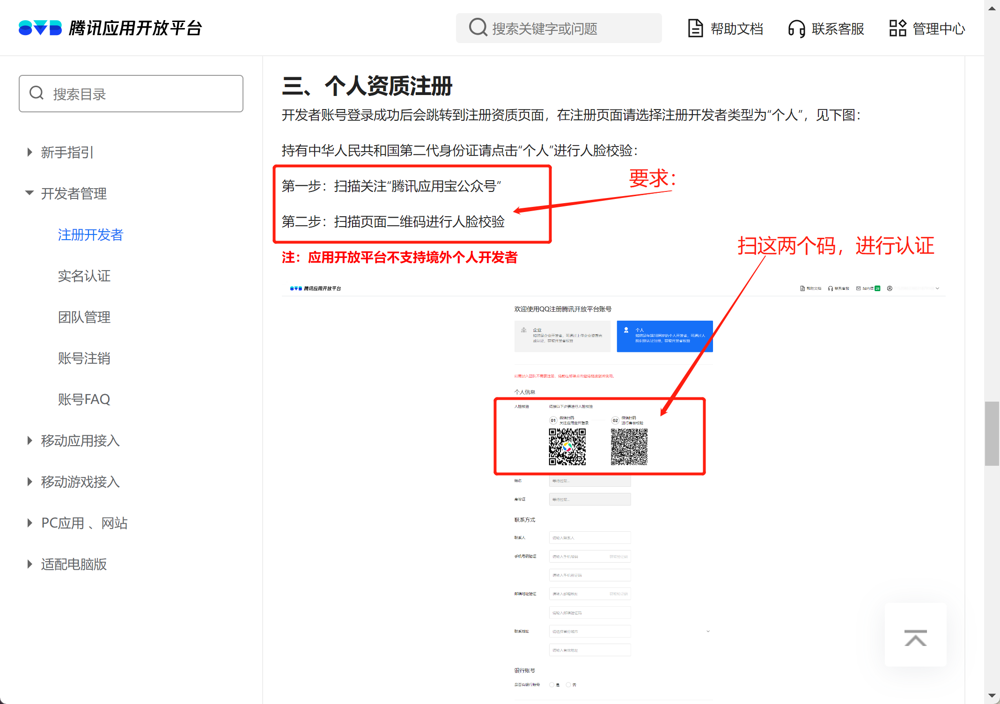
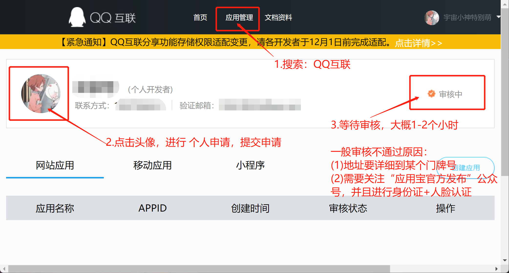

# qq-login

**说明**

预研接入QQ第三方平台登录

## Java接入QQ登录的基本步骤

要在Java中实现QQ登录，您可以使用QQ互联（QQ Connect）的API。
QQ互联提供了一组API，允许您使用QQ账号进行用户认证和授权。

以下是使用Java接入QQ登录的基本步骤：

1. 注册为QQ互联开发者：访问QQ互联开发者平台（https://connect.qq.com），注册为开发者并创建一个应用。
2. 获取应用的App ID和App Key：在QQ互联开发者平台创建应用后，您将获得一个App ID和App Key。这些凭证将用于在Java代码中进行身份验证。
3. 配置回调URL：在QQ互联开发者平台的应用配置中，设置回调URL。当用户授权后，QQ互联将重定向到此URL并返回授权码。
4. 编写Java代码：使用Java编写代码来实现QQ登录。您可以使用HTTP请求库（如Apache HttpClient或OkHttp）发送请求到QQ互联的API端点，并处理响应。

## 1.注册QQ互联开发者

注册开发者实名认证：https://wikinew.open.qq.com/index.html#/iwiki/4007776081


注册地址：[connect.qq.com](https://connect.qq.com)


创建应用：

## 2.获取应用的App ID和App Key

注意，要先有一个网站，并且不能太简单，有登录功能，有QQ登录入库图标.

## 3.配置回调地址

## 4.Java编写代码来实现QQ登录

首先，构建授权链接，将用户重定向到QQ登录页面：

```java
String appId="YOUR_APP_ID";
        String redirectUri="YOUR_REDIRECT_URI";
        String authorizeUrl="https://graph.qq.com/oauth2.0/authorize?response_type=code&client_id="+appId+"&redirect_uri="+redirectUri;
// 将用户重定向到authorizeUrl
```

当用户在QQ登录页面上进行登录和授权后，QQ互联将重定向到您指定的回调URL，并返回授权码。
使用授权码获取访问令牌（Access Token）：

```java
String code="AUTHORIZATION_CODE"; // 授权码
        String tokenUrl="https://graph.qq.com/oauth2.0/token?grant_type=authorization_code&client_id="+appId+"&client_secret="+appKey+"&code="+code+"&redirect_uri="+redirectUri;

// 发送HTTP请求到tokenUrl获取访问令牌
// 解析和提取访问令牌
```

使用访问令牌调用API获取用户信息：

```java
String accessToken="ACCESS_TOKEN"; // 访问令牌
        String openIdUrl="https://graph.qq.com/oauth2.0/me?access_token="+accessToken;

// 发送HTTP请求到openIdUrl获取用户的OpenID
// 解析和提取OpenID

        String userInfoUrl="https://graph.qq.com/user/get_user_info?access_token="+accessToken+"&oauth_consumer_key="+appId+"&openid="+openId;

// 发送HTTP请求到userInfoUrl获取用户信息
// 解析和处理用户信息
```

这只是一个简单的示例代码，您还需要根据具体需求和使用的HTTP库进行适当的处理。