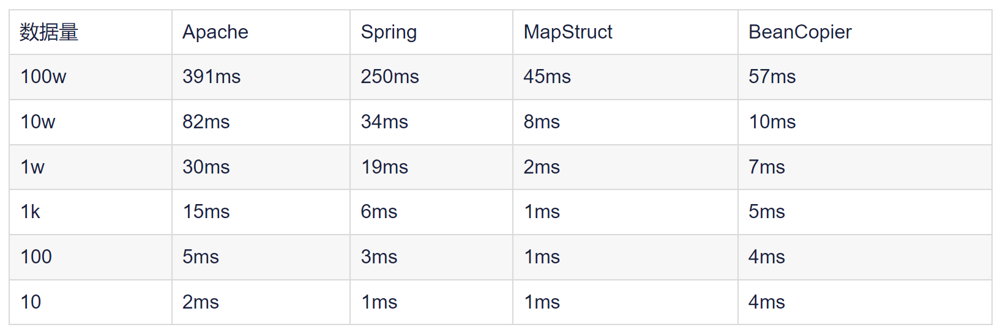

# springboot-mapping

**对象属性映射 如：dozer、mapstruct**

## spring-boot 集成(组件)示例

> 以下是已经完成的示例模块

- [springboot-mapping-dozer](./springboot-mapping-dozer)
- [springboot-mapping-mapstruct 推荐](./springboot-mapping-mapstruct)

在Java开发中，经常需要在不同的层（如数据访问层、服务层、控制层、视图层）之间传递数据。这些数据通常以JavaBean的形式存在，而不同的层可能需要不同的JavaBean来适应其特定的需求。例如，DTO用于数据传输，DO用于数据库映射，VO用于视图渲染等。在这些JavaBean之间转换数据是一个常见的需求，但手动编写大量的setter和getter调用以复制数据是非常繁琐和容易出错的。因此，有多种工具和库可以帮助自动化这一过程。

# 对象拷贝的方式

## 浅拷贝

浅拷贝意味着只复制对象的引用，而不复制对象引用的对象。对于JavaBean来说，浅拷贝通常意味着只复制基本数据类型和引用类型的引用，而不复制引用类型指向的对象本身。

### 1.Apache的BeanUtils：

Apache的BeanUtils是一个基于反射的工具，用于简化JavaBean的操作。它提供了copyProperties方法，该方法通过反射机制自动调用setter方法将源对象的属性值复制到目标对象的相应属性中。

* 优点：简单易用，支持基本类型自动转换。
* 缺点：性能较低，因为使用了反射。

### 2.Spring的BeanUtils：

Spring框架也提供了自己的BeanUtils类，功能与Apache的BeanUtils类似，但实现细节可能有所不同。

* 优点：与Spring框架集成良好，易于在Spring项目中使用。
* 缺点：同样存在性能问题，因为使用了反射。

### 3.BeanCopier（Cglib）：

BeanCopier是Cglib库中的一个类，它通过动态代理的方式实现对象的复制。与基于反射的方法相比，BeanCopier通常具有更好的性能。

* 优点：性能较高，因为避免了反射的开销。
* 缺点：需要目标对象已经实例化，并且对象必须有setter方法。

## 深拷贝

深拷贝意味着不仅复制对象本身，还复制对象引用的所有对象。对于JavaBean来说，深拷贝会复制所有基本数据类型和引用类型指向的对象本身。

### 1.MapStruct：

MapStruct是一个Java注释处理器，它在编译时生成类型安全的bean映射代码。这意味着MapStruct不会使用反射来执行映射，而是直接生成调用setter方法的代码。

* 优点：
* 速度快：因为避免了反射的开销。
* 编译时类型安全性：只能在编译时检查映射的正确性，减少了运行时错误的可能性。
* 易于使用：通过简单的注解即可定义映射规则。
* 缺点：需要额外的编译步骤来生成映射代码。

总的来说，选择哪种对象拷贝方式取决于具体的需求和场景。如果性能是关键考虑因素，那么BeanCopier或MapStruct可能是更好的选择。如果易用性和集成性更重要，那么Apache的BeanUtils或Spring的BeanUtils可能更适合。对于需要深拷贝的场景，MapStruct是一个强大的选择。

# 技术选型

MapStruct在速度上表现最佳，是Apache BeanUtils的10倍、Spring BeanUtils的4-5倍，与BeanCopier相当。大数据处理时，MapStruct和BeanCopier性能优越，尤其MapStruct更优。日常少量数据处理时选择影响不大，但大数据量时建议采用MapStruct或BeanCopier以提高性能。