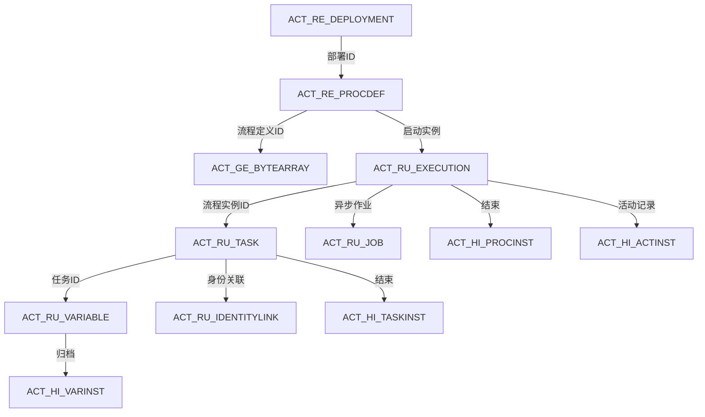

# Flowable 工作流引擎的**核心表关系图**及**流程生命周期与表状态变化**的系统解析


以下是基于 Flowable 工作流引擎的**核心表关系图**及**流程生命周期与表状态变化**的系统解析，结合关键表结构、字段说明及数据流转逻辑，帮助开发者深入理解引擎内部机制。

------

### 🔄 **一、核心表关系图**



#### **核心表说明**

| **表名**              | **作用**                                     | **关键字段**                                                 | **生命周期**           |
| :-------------------- | :------------------------------------------- | :----------------------------------------------------------- | :--------------------- |
| **ACT_RE_DEPLOYMENT** | 存储部署记录（如BPMN文件上传）               | `ID_`（部署ID）, `NAME_`, `DEPLOY_TIME_`                     | 永久保存               |
| **ACT_RE_PROCDEF**    | 存储流程定义元数据                           | `ID_`（流程定义ID）, `KEY_`（流程业务键）, `VERSION_`, `DEPLOYMENT_ID_` | 永久保存               |
| **ACT_RU_EXECUTION**  | 运行时流程实例及执行路径（核心表）           | `ID_`（执行ID）, `PROC_INST_ID_`（流程实例ID）, `ACT_ID_`（当前节点）, `IS_ACTIVE_`（活动状态） | 流程结束时**自动删除** |
| **ACT_RU_TASK**       | 运行时任务（如用户待办）                     | `ID_`（任务ID）, `NAME_`, `ASSIGNEE_`（处理人）, `PROC_INST_ID_` | 任务完成后删除         |
| **ACT_RU_VARIABLE**   | 运行时流程变量                               | `NAME_`（变量名）, `TEXT_`（值）, `EXECUTION_ID_`（关联执行ID） | 流程结束时删除         |
| **ACT_HI_PROCINST**   | 历史流程实例记录                             | `START_TIME_`, `END_TIME_`, `DURATION_`, `START_USER_ID_`    | 永久保存               |
| **ACT_HI_ACTINST**    | 历史活动节点记录（包括网关、事件等所有节点） | `ACT_ID_`, `ACT_NAME_`, `START_TIME_`, `END_TIME_`           | 永久保存               |

> 💡 **关联关系关键点**：
>
> - **流程定义 → 实例**：`ACT_RE_PROCDEF.ID_` → `ACT_RU_EXECUTION.PROC_DEF_ID_`
> - **任务 → 执行**：`ACT_RU_TASK.EXECUTION_ID_` → `ACT_RU_EXECUTION.ID_`
> - **变量 → 实例**：`ACT_RU_VARIABLE.PROC_INST_ID_` → `ACT_RU_EXECUTION.PROC_INST_ID_`

------

### ⚙️ **二、流程生命周期与表状态变化**

#### **1. 部署阶段**

```java
// 部署流程定义
Deployment deployment = repositoryService.createDeployment()
    .addClasspathResource("leave.bpmn20.xml")
    .deploy();
```

**表变化**：

- `ACT_RE_DEPLOYMENT` 新增部署记录
- `ACT_RE_PROCDEF` 新增流程定义（如 `KEY_=leaveProcess, VERSION_=1`）
- `ACT_GE_BYTEARRAY` 存储BPMN文件二进制流36

#### **2. 启动流程实例**

```java
ProcessInstance instance = runtimeService.startProcessInstanceByKey("leaveProcess");
```

**表变化**：

| **表名**             | **操作**   | **关键字段变化**                                             |
| :------------------- | :--------- | :----------------------------------------------------------- |
| **ACT_RU_EXECUTION** | ↑ 新增记录 | `ID_=1001`, `PROC_INST_ID_=1001`（主执行）, `ACT_ID_=startEvent` |
| **ACT_HI_PROCINST**  | ↑ 新增记录 | `START_TIME_=2025-08-14 10:00:00`, `START_USER_ID_=user1`    |
| **ACT_HI_ACTINST**   | ↑ 新增记录 | `ACT_ID_=startEvent`, `ACT_TYPE_=startEvent`                 |
| **ACT_RU_VARIABLE**  | ↑ 新增变量 | 若启动时传入变量（如 `days=3`），在此表记录                  |

#### **3. 任务处理阶段**

```java
Task task = taskService.createTaskQuery().taskAssignee("manager").singleResult();
taskService.complete(task.getId());
```

**表变化**：

| **操作**     | **ACT_RU_TASK**             | **ACT_HI_TASKINST**           | **ACT_HI_ACTINST**                     |
| :----------- | :-------------------------- | :---------------------------- | :------------------------------------- |
| **任务创建** | ↑ 新增记录（如 `审批任务`） | ↑ 新增记录                    | ↑ 新增记录（任务节点）                 |
| **任务完成** | ↓ 删除该任务记录            | 更新 `END_TIME_`, `DURATION_` | 更新当前节点结束时间，新增下一节点记录 |

#### **4. 流程结束**

```java
// 最后一个任务完成，流程结束
```

**表变化**：

- **运行时表清空**：`ACT_RU_EXECUTION`, `ACT_RU_TASK`, `ACT_RU_VARIABLE` 删除该流程实例所有记录
- **历史表归档**：
  - `ACT_HI_PROCINST` 更新 `END_TIME_`, `DURATION_`
  - `ACT_HI_ACTINST` 记录结束事件节点
  - `ACT_HI_VARINST` 持久化所有变量值

------

### 🧩 **三、特殊场景解析**

#### **1. 子流程运行时**

- **表表现**：
  - `ACT_RU_EXECUTION` 新增子执行记录，`PARENT_ID_` 指向父执行ID，`PROC_INST_ID_` 与父流程相同14
  - `IS_ACTIVE_=0` 表示父流程挂起，子流程 `IS_ACTIVE_=1`

#### **2. 并行网关分支**

- **表表现**：
  - `ACT_RU_EXECUTION` 生成多条执行记录（分支数=记录数），`IS_CONCURRENT_=1`
  - 每个分支在 `ACT_RU_TASK` 生成独立任务

#### **3. 历史级别影响**

配置 `flowable.history-level` 决定历史表记录粒度：

- **none**：不记录历史
- **activity**：仅记录节点（默认）
- **audit**：记录节点+变量
- **full**：全量记录（包括表单细节）

------

### ⚡ **四、性能优化实践**

1. **索引策略**：

   - 高频查询字段（如 `PROC_INST_ID_`, `TASK_DEF_KEY_`）添加复合索引：

     ~~~sql
     CREATE INDEX idx_proc_inst_task ON ACT_RU_TASK (PROC_INST_ID_, TASK_DEF_KEY_);
     ~~~

2. **数据归档**：

   - 定期将 `ACT_HI_*` 表数据迁移至归档表（如每月执行）

3. **异步执行器**：

   - 启用 `flowable.async-executor-activate=true`，将耗时操作（如邮件通知）交给 `ACT_RU_JOB` 处理

------

### 📊 **五、与其他引擎表结构对比**

| **引擎**     | **相似点**          | **核心差异**                          |
| :----------- | :------------------ | :------------------------------------ |
| **Activiti** | 相同表前缀（ACT_）  | 缺少 `ACT_RU_ACTINST`（运行时活动表） |
| **Camunda**  | 类似运行时/历史分离 | 特有 `CAM_` 前缀表（如授权管理）      |
| **jBPM**     | 流程概念一致        | 表名前缀为 `JBPM_`，结构更扁平        |

> 通过以上解析，可掌握 Flowable **数据流转全链路**。实际调试时，重点关注：
>
> 1. 流程启动 → 检查 `ACT_RU_EXECUTION` 和 `ACT_HI_PROCINST`；
> 2. 任务卡顿 → 查询 `ACT_RU_TASK` 的 `ASSIGNEE_` 是否分配；
> 3. 变量异常 → 追踪 `ACT_RU_VARIABLE` 和 `ACT_HI_VARINST`
