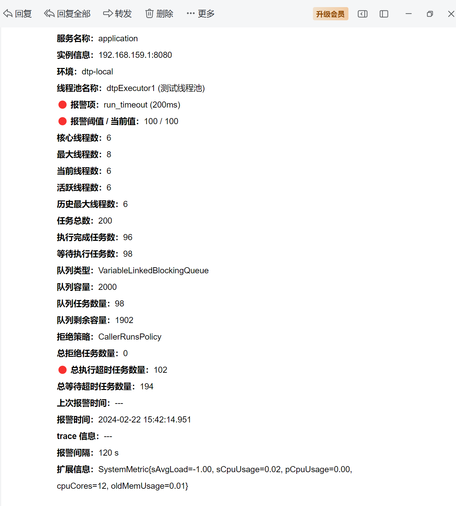

# springboot-thread-dynamic-tp

- [dynamictp 官网](https://dynamictp.cn/)
- [dynamictp 官网文档-快速开始](https://dynamictp.cn/guide/use/quick-start.html)

**说明**

## 接入步骤

1. 引入相应配置中心的依赖 [maven 依赖](https://dynamictp.cn/guide/configcenter/apollo/#maven%E4%BE%9D%E8%B5%96)
2.

配置中心配置线程池实例 [配置文件](https://dynamictp.cn/guide/configcenter/apollo/#%E7%BA%BF%E7%A8%8B%E6%B1%A0%E9%85%8D%E7%BD%AE%E6%96%87%E4%BB%B6)

3. 启动类加 @EnableDynamicTp 注解
4. 使用 @Resource 或 @Autowired 进行依赖注入，或通过 DtpRegistry.getExecutor("name") 获取
5. 通过以上 4 步就可以接入使用了，是不是感觉超级简单呀

## 无配置中心应用接入 实例

- [无配置中心应用接入](https://dynamictp.cn/guide/configcenter/none.html)

> 无配置中心可以用此依赖，将配置放到本地配置文件中，无动态调参功能，但有监控告警功能

提示

1. 动态线程池配置文件，建议单独开一个配置文件，方便管理
2. 建议最好使用 yml 文件配置，可读性、可操作性更友好
3. 给出的是全配置项，使用不到的项或者使用默认值的项都可以删除，减少配置量
4. 集成失败 90% 以上情况都是使用姿势有误 / 版本兼容问题，有版本兼容性问题可以提 Issues 或加群反馈

警告

1. 下述配置项的值都是随便填写的，请不要直接使用该值，根据自己项目做调整

依赖引入

```xml
<!--SpringBoot1x、2x 用此依赖-->
<dependency>
    <groupId>org.dromara.dynamictp</groupId>
    <artifactId>dynamic-tp-spring-boot-starter-common</artifactId>
    <version>1.1.6.1</version>
</dependency>

```

线程池配置文件

```yaml
spring:
  dynamic:
    tp:
      enabled: true                               # 是否启用 dynamictp，默认true
      enabledCollect: true                        # 是否开启监控指标采集，默认true
      collectorTypes: micrometer,logging          # 监控数据采集器类型（logging | micrometer | internal_logging | JMX），默认micrometer
      logPath: /home/logs/dynamictp/user-center/  # 监控日志数据路径，默认 ${user.home}/logs，采集类型非logging不用配置
      monitorInterval: 5                          # 监控时间间隔（报警检测、指标采集），默认5s
      platforms: # 通知报警平台配置
        - platform: wechat
          platformId: 1                            # 平台id，自定义
          urlKey: 3a700-127-4bd-a798-c53d8b69c     # webhook 中的 key
          receivers: test1,test2                   # 接受人企微账号

        - platform: ding
          platformId: 2                            # 平台id，自定义
          urlKey: f80dad441fcd655438f4a08dcd6a     # webhook 中的 access_token
          secret: SECb5441fa6f375d5b9d21           # 安全设置在验签模式下才的秘钥，非验签模式没有此值
          receivers: 18888888888                   # 钉钉账号手机号

        - platform: lark
          platformId: 3
          urlKey: 0d944ae7-b24a-40                 # webhook 中的 token
          secret: 3a750012874bdac5c3d8b69c         # 安全设置在签名校验模式下才的秘钥，非验签模式没有此值
          receivers: test1,test2                   # 接受人username / openid

        - platform: email
          platformId: 4
          receivers: 123456@qq.com,789789@qq.com   # 收件人邮箱，多个用逗号隔开

      executors: # 动态线程池配置，都有默认值，采用默认值的可以不配置该项，减少配置量
        - threadPoolName: dtpExecutor1
          threadPoolAliasName: 测试线程池        # 线程池别名
          executorType: common                 # 线程池类型 common、eager、ordered、scheduled、priority，默认 common
          corePoolSize: 6                      # 核心线程数，默认1
          maximumPoolSize: 8                   # 最大线程数，默认cpu核数
          queueCapacity: 2000                  # 队列容量，默认1024
          queueType: VariableLinkedBlockingQueue         # 任务队列，查看源码QueueTypeEnum枚举类，默认VariableLinkedBlockingQueue
          rejectedHandlerType: CallerRunsPolicy          # 拒绝策略，查看RejectedTypeEnum枚举类，默认AbortPolicy
          keepAliveTime: 60                              # 空闲线程等待超时时间，默认60
          threadNamePrefix: test                         # 线程名前缀，默认dtp
          allowCoreThreadTimeOut: false                  # 是否允许核心线程池超时，默认false
          waitForTasksToCompleteOnShutdown: true         # 参考spring线程池设计，优雅关闭线程池，默认false
          awaitTerminationSeconds: 5                     # 优雅关闭线程池时，阻塞等待线程池中任务执行时间，默认0，单位（s）
          preStartAllCoreThreads: false                  # 是否预热所有核心线程，默认false
          runTimeout: 200                                # 任务执行超时阈值，目前只做告警用，单位（ms），默认0
          queueTimeout: 100                              # 任务在队列等待超时阈值，目前只做告警用，单位（ms），默认0
          taskWrapperNames: [ "ttl", "mdc" ]               # 任务包装器名称，继承TaskWrapper接口
          notifyEnabled: true                            # 是否开启报警，默认true
          notifyItems: # 报警项，不配置自动会按默认值配置（变更通知、容量报警、活性报警、拒绝报警、任务超时报警）
            - type: change
              enabled: true
            - type: capacity               # 队列容量使用率，报警项类型，查看源码 NotifyTypeEnum枚举类
              enabled: true
              threshold: 80                # 报警阈值，默认70，意思是队列使用率达到70%告警
              platforms: [ ding,wechat ]     # 可选配置，不配置默认拿上层platforms配置的所有平台
              interval: 120                # 报警间隔（单位：s），默认120
            - type: liveness               # 线程池活性
              enabled: true
              threshold: 80                # 报警阈值，默认 70，意思是活性达到70%告警
            - type: reject                 # 触发任务拒绝告警
              enabled: true
              threshold: 100               # 默认阈值10
            - type: run_timeout            # 任务执行超时告警
              enabled: true
              threshold: 100               # 默认阈值10
            - type: queue_timeout          # 任务排队超时告警
              enabled: true
              threshold: 100               # 默认阈值10

```

代码实例：线程池配置

```java
@Configuration
public class ThreadPoolConfiguration {

    /**
     * 通过{@link ThreadPoolCreator} 快速创建一些简单配置的线程池，使用默认参数
     * tips: 建议直接在配置中心配置就行，不用@Bean声明
     *
     * @return 线程池实例
     */
    @Bean
    public DtpExecutor dtpExecutor0() {
        return ThreadPoolCreator.createDynamicFast("dtpExecutor0");
    }

    /**
     * 通过{@link ThreadPoolBuilder} 设置详细参数创建动态线程池
     * tips: 建议直接在配置中心配置就行，不用@Bean声明
     *
     * @return 线程池实例
     */
    @Bean
    public ThreadPoolExecutor dtpExecutor1() {
        return ThreadPoolBuilder.newBuilder()
                .threadPoolName("dtpExecutor1")
                .threadFactory("test-dtp-common")
                .corePoolSize(10)
                .maximumPoolSize(15)
                .keepAliveTime(40)
                .timeUnit(TimeUnit.SECONDS)
                // .workQueue(MEMORY_SAFE_LINKED_BLOCKING_QUEUE.getName(), 2000)
                .workQueue(MEMORY_SAFE_LINKED_BLOCKING_QUEUE.getName(), 100)
                .buildDynamic();
    }
}
```

代码实例：线程池使用

```java
@Slf4j
@Service
public class DynamicTPService {
    // DynamicTP 提供的增强线程池 DtpExecutor
    @Resource
    private ThreadPoolExecutor dtpExecutor0;  // 增强线程池 DtpExecutor
    // @Resource
    // private DtpExecutor dtpExecutor1; // 增强线程池 DtpExecutor

    // 通过Bean 获取dtp执行器
    public void dtpExecutor0_taskExample() throws InterruptedException {
        for (int i = 0; i < 10; i++) {
            // Thread.sleep(100);
            dtpExecutor0.execute(() -> {
                try {
                    Thread.sleep(1000);
                    log.info("i am dynamic-tp-test-0 task");
                } catch (InterruptedException e) {
                    e.printStackTrace();
                    // throw new RuntimeException(e);
                }
            });
        }
    }

    // 通过DtpRegistry.getDtpExecutor("") 获取dtp执行器
    public void dtpExecutor1_taskExample() throws InterruptedException {
        // 获取dtp执行器
        DtpExecutor dtpExecutor1 = DtpRegistry.getDtpExecutor("dtpExecutor1");
        for (int i = 0; i < 200; i++) {
            // Thread.sleep(100);
            dtpExecutor1.execute(NamedRunnable.of(() -> {
                try {
                    Thread.sleep(1000);
                    log.info("i am dynamic-tp-test-1 task");
                } catch (InterruptedException e) {
                    e.printStackTrace();
                    // throw new RuntimeException(e);
                }
            }, "task-" + i));
        }
    }
}
```

## 通知预警-邮箱通知

引入依赖

```xml
<!--SpringBoot1x、2x 用此依赖-->
 <dependency>
     <groupId>org.dromara.dynamictp</groupId>
     <artifactId>dynamic-tp-spring-boot-starter-extension-notify-email</artifactId>
     <version>1.1.6.1</version>
 </dependency>   

```

加入邮件相关配置

```yaml
spring:
  # 配置邮箱通知
  # email notify configuration
  mail:
    # (optional) email subject, default:ThreadPool Notify
    title: ThreadPool Notify
    # mail service address
    host: smtp.qq.com
    port: 465
    # send from
    username: 123456@qq.com
    # authorization code eg: rlpadadtcugh4152e
    password: xxxxxxxxxxxxxxxx
    default-encoding: UTF-8
    properties:
      mail:
        smtp:
          socketFactoryClass: javax.net.ssl.SSLSocketFactory
          ssl:
            enable: true
        debug: false

  dynamic:
    tp:
      enabled: true # 是否启用 dynamictp，默认true
      platforms: # 通知报警平台配置
        - platform: email
          platformId: 4
          receivers: 123456@qq.com,789789@qq.com   # 收件人邮箱，多个用逗号隔开
```

邮箱通知示例


